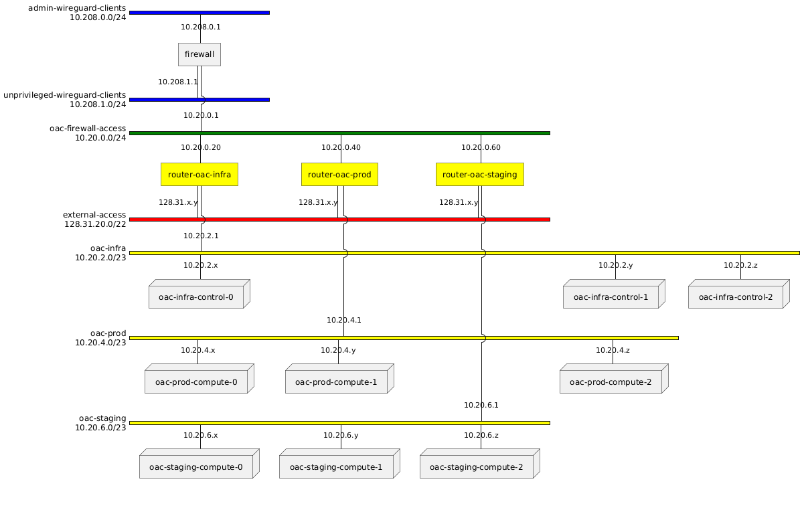

#  VPN Access

This document describes our configuration for permitting VPN access to open accelerator (OAC) cluster nodes deployed on OpenStack private networks.

## Network architecture



- OpenStack resources are $${\color{yellow}yellow}$$.
- Transit networks are $${\color{green}green}$$.
- Externally routable networks are $${\color{red}red}$$.
- Client VPN networks are $${\color{blue}blue}$$.

## Client VPN networks

Clients access internal resources via a [WireGuard] VPN (using the `10.208.0.0/23` address range). People who need access to internal network will need to generate a WireGuard key pair and provide the public key to the VPN administrators. Under Linux, with the `wireguard-tools` package installed, you can generate a keypair like this:

```
wg genkey | tee wg.secret | wg pubkey > wg.public
```

This places the secret key in `wg.secret` and the public key in `wg.public`.

[wireguard]: https://www.wireguard.com/

## Internal networks

Each cluster (infra, staging, prod) is deployed on an isolated OpenStack network. Since we're routing to the networks from the firewall, each network has a unique, non-overlapping CIDR allocation:

| Network | CIDR Allocation |
| ------- | --------------- |
| infra   | 10.20.2.0/23    |
| staging | 10.20.4.0/23    |
| prod    | 10.20.6.0/23    |

Each network has an associated router with three interfaces:

1. The internal network itself
2. The public `external` network
3. The firewall transit network (`oac-fw-net`)

In order to properly route traffic from WireGuard VPN clients, each router has a custom route to `10.208.0.0/23` via `10.20.0.1`.

## Firewall transit network

The firewall transit network is exposed to the OpenStack environment as a [provider network]. A "provider network" is an OpenStack network that is associated with an existing physical network (in this case, VLAN 212). We are using the `10.20.0.0/24` address range for this network. The firewall is attached to the transit network at the `.1` address (`10.20.0.1`).

> [!NOTE]
> Creating a provider network (and assigning fixed addresses to ports) requires administrative privileges in OpenStack.

[provider network]: https://docs.openstack.org/install-guide/launch-instance-networks-provider.html

The router for each OpenStack network has an interface on the firewall transit network:

| Network | Firewall transit network address |
| ------- | -------------------------------- |
| infra   | 10.20.0.20                       |
| staging | 10.20.0.40                       |
| prod    | 10.20.0.60                       |
